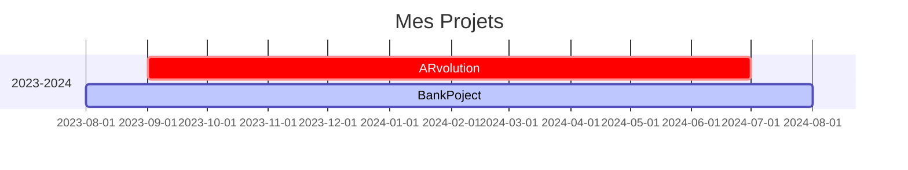
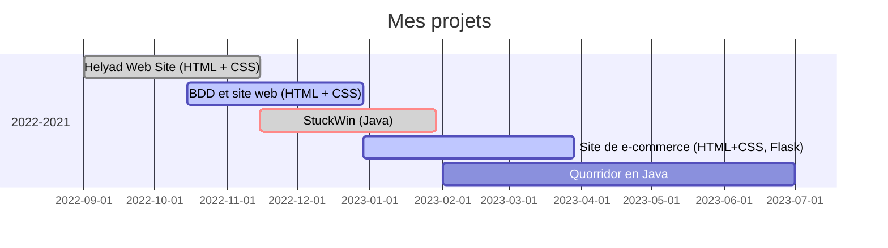

**Salut, je m'appelle Titouan**, Étudiant en informatique à Belfort, préférant le Backend au Front, je fais aussi du développement Java.
J'adore le café, et cuisiner aussi (même si mes amis trouvent cela expérimental)

# Projets informatiques 

### 2023-2024 (en cours) 
- 🌐 Création d'une application web Full-Stack de gestion d’une manifestation (forum de la réalité virtuel)

  | équipe de 4 |

- 💼 Création d’une application de gestion Bancaire personnelle
  
  | projet solo |

### 2022-2023
- 🏢 Création d'un site web de présentation d'une entreprise

  | équipe de 4 |
- 📊 Création d'une base de Données ainsi qu'un site web de gestion de cette dernière pour une entreprise de gestion des déchets

  | équipe de 4 |
- 🎲 StuckWin-Game : développement d'un jeu de société ainsi qu'une intelligence de jeu. 

  | Projet solo |
- 🛒 Création d'un site web e-commerce de vente de meuble en full-stack

  | équipe de 4 |
  
- 🧪 Mise en place des tests unitaires d'un jeu en Java, gestion d'une équipe

  | équipe de 5 |

### 2021
- 🛰️ Création d'un device permettant de récupérer sa position GPS ainsi que de la partager via le réseau LoRaWAN

  | projet solo |

### 2020
- 🛍️ Création d'un site vitrine et d'ecommerce pour une boutique (WordPress + Elementor)

  | projet solo |

# Amélioration en Cours
- 📚 J'essaye à l'heure actuelle de m'améliorer en JavaScript avec les environnements Node.js et Vue.js, je suis ouvert à toute aide d'ailleurs 🤩

# Languages et informatiques utilisée

| Java | Python | Javascript | HTML5 | CSS3 | NodeJS | Flask | VueJS| BootStrap |
|------|--------|--|------------|------|-----|--------|--|--|

<!---
ttherezien/ttherezien is a ✨ special ✨ repository because its `README.md` (this file) appears on your GitHub profile.
You can click the Preview link to take a look at your changes.
--->
